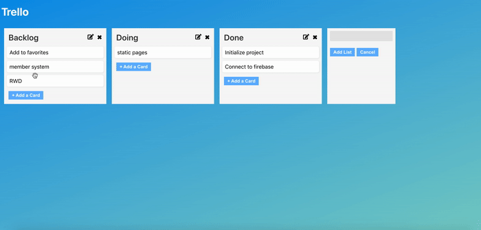
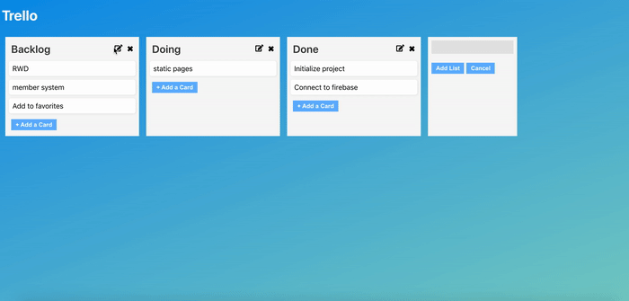

# Trello-Like
A management tool that helps organizing projects or anything with draggable cards.  

## Techonologies
- Front-End Fundamental
    - HTML / CSS / JavaScript
- Front-End Library
    - React
- Third party packages
    - React Beautiful Dnd
## Demo
Website: https://b2410832.github.io/Trello-React-Midterm/
### Add Lists

### Add Cards to Lists

### Drag Cards

### Edit Name of Lists

